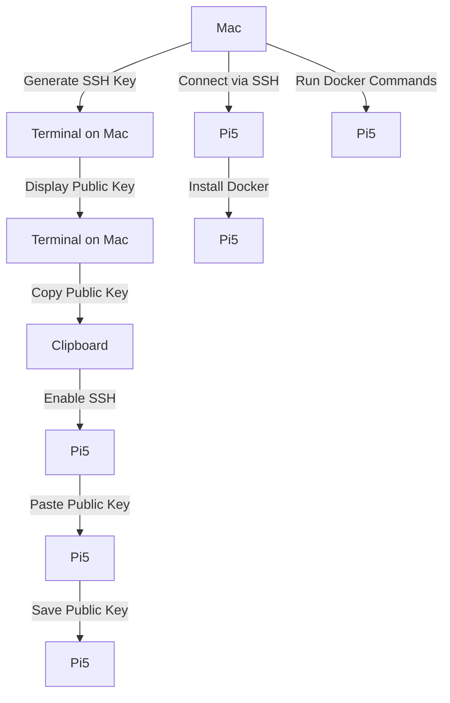

## DockerHOST with Pi5

**Yo, Docker Peeps! Unleash Containerized Magic on Your Pi5 from Your Mac**

Calling all Docker devotees! Ever dreamt of orchestrating containerized wonders on your Raspberry Pi 5 from the comfort of your Mac? Buckle up, because we're diving into a voyage of containerized conquest!

**But wait, there's a twist!** DockerHOST doesn't exist as a standalone tool. Fear not, for we'll leverage a potent combo: Docker Desktop for Mac and SSH.
**Note you can use this to connect to any linux or host with ssh so this is a good practicum in ssh connectivity, if that's your need/thing**

**Here's the Treasure Map (a.k.a. Prerequisites):**

- **Mac with Apple Silicon (M1, M2, etc.)** (Docker Desktop for Mac on Intel Macs doesn't support direct connection to ARM-based devices yet)
- **Raspberry Pi 5 running a compatible OS** (e.g., Raspberry Pi OS Bullseye/Bookworm for ARM64 architecture)
- **SSH client on your Mac** (Terminal or a dedicated app like iTerm2)

**Step 1: Chart Your Course (Enabling SSH on Pi5):**

1. Boot up your Pi5 and connect a keyboard/monitor.
2. Access the Raspberry Pi configuration tool (usually `raspi-config`).
3. Navigate to "Interfacing Options" > "SSH" and enable it.
4. Reboot your Pi5 for the changes to take effect.

**Step 2: KeyGen: Secure the Connection (Generating SSH Keys):**

1. On your Mac, open Terminal and type:

    ```bash
    ssh-keygen -t rsa -b 4096 -C "your_email@example.com"
    ```

    Replace `your_email@example.com` with your actual email address. This creates a key pair (public and private keys) for secure authentication.

2. When prompted, enter a secure passphrase to protect your private key.

**Step 3: Bridge the Gap (Adding the Public Key to Pi5):**

1. Display the public key content using:

    ```bash
    cat ~/.ssh/id_rsa.pub
    ```

2. Copy the entire output (everything from `ssh-rsa` to the end of the line).

3. On your Pi5 (using SSH from another machine or directly connected), paste the copied key content into a new file named `authorized_keys` within the `.ssh` directory of your Pi5 user account (e.g., `pi`):

    ```bash
    nano ~/.ssh/authorized_keys
    ```

    Paste the key content and save the file (Ctrl+O, then Enter, followed by Ctrl+X).

**Step 4: Set Sail! Connect to Your Pi5:**

Now, from your Mac's Terminal, you can connect to your Pi5 using SSH:

```bash
ssh pi@<your_pi5_ip_address>
```

Replace `<your_pi5_ip_address>` with the actual IP address of your Pi5 (obtain it using `hostname -I` on your Pi5). If prompted for a passphrase, enter the one you created during key generation.

**Step 5: The Docker Engine Awaits (Installing Docker on Pi5):**

1. Update package lists:

    ```bash
    sudo apt update
    ```

2. Install Docker and its dependencies:

    ```bash
    sudo apt install docker docker-compose -y
    ```

3. Add your user (e.g., `pi`) to the `docker` group to avoid using `sudo` every time:

    ```bash
    sudo usermod -aG docker pi
    ```

    Log out and log back in for the changes to take effect.

**Step 6: Captain the Dock (Verify Docker Installation):**

1. Check the Docker version:

    ```bash
    docker version
    ```

    You should see a response indicating Docker is installed and running.

**Step 7: Chart a Course for Containerized Adventures (Running Containers):**

With SSH established and Docker operational on your Pi5, you can now leverage Docker commands remotely from your Mac! Here's the basic syntax:

```bash
ssh pi@<your_pi5_ip_address> docker <command> <options>
```

For instance, to list running containers:

```bash
ssh pi@<your_pi5_ip_address> docker ps
```

**Bonus: Build and Deploy from the Helm of Your Mac (Using Docker Compose):**

1. Create a `docker-compose.yml` file on your Mac with the desired container configuration.
2. Transfer the file to your pi
3. Start rocking the deployment

**Diagram:**


